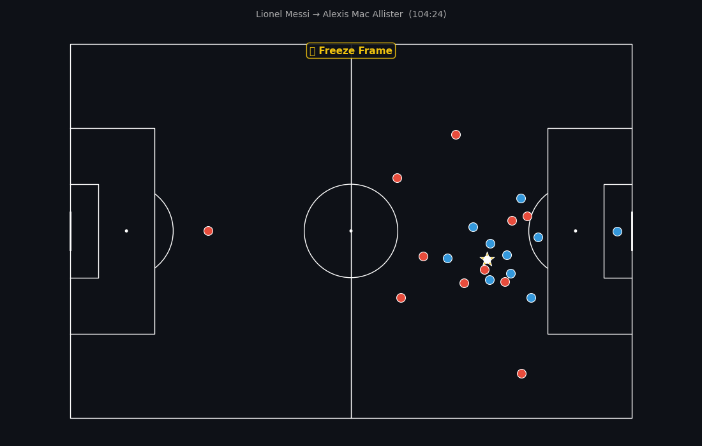
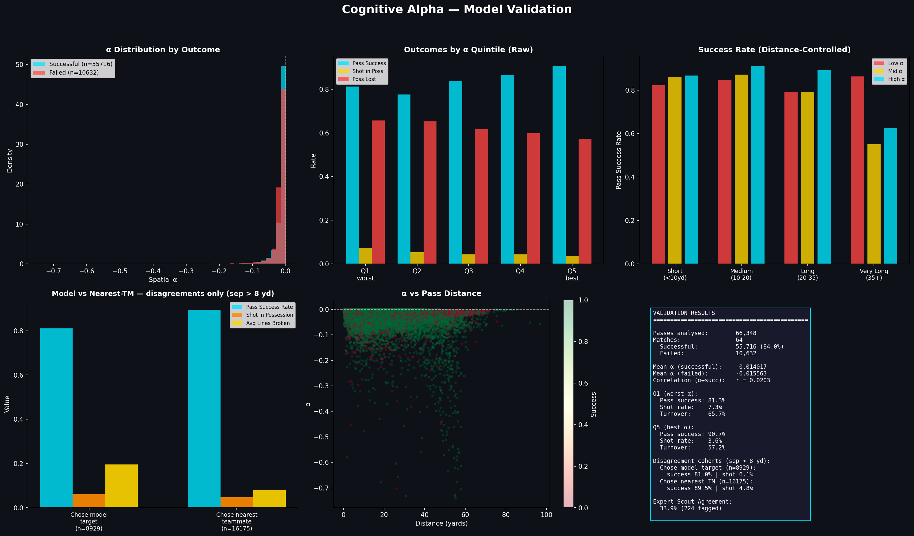

# Cognitive Alpha


Spatial decision quality in football. For every open-play pass of the 2022 FIFA World Cup, the model measures the gap between the pass the player actually chose and the best option that was physically available:

```
alpha = xEV(actual target) − xEV(optimal target)
```

where the expected value of a target location combines five surfaces evaluated on a continuous 120×80 grid: pitch control, expected threat, pass completion probability, receiver sprint feasibility, and a post-receipt survival penalty (the "hospital pass" discount). Alpha near zero means the player found the best option; strongly negative alpha flags a missed opportunity. An interactive Streamlit dashboard replays any pass with the full surface, the optimum, and the actual choice.



*Above: rendered by the dashboard's animation engine — Messi to Mac Allister in extra time of the final. The full star is the model's optimal target, the hollow one the actual choice.*

## Components

**Expected Threat, trained from scratch** (`train_xt.py`). Markov-chain value iteration on StatsBomb event data: 125,566 open-play possession actions (251,132 after Y-axis mirroring) drawn from the 234,652-event log of all 64 matches. Failed passes are treated as absorbing states, so the transition matrix is turnover-aware. Converges in 100 iterations (Δ < 1e-8). The raw 12×8 grid correlates at r = 0.85 with Karun Singh's published Premier League grid, r = 0.93 after Gaussian smoothing — close enough to be sane, different enough to carry World Cup-specific structure. Smoothed and bilinearly interpolated to a continuous surface.

**Pitch control** (`pitch_control.py`). Spearman-style (2018): kinematic time-to-arrival with reaction time and acceleration, squashed through a logistic sigmoid, fully vectorised over the grid (no per-cell Python loops). Extensions: per-player sprint speeds for known players (Mbappé is not a median defender), a ground/lofted ball toggle with distinct speeds and decay kernels, an offside mask that assigns negative turnover value to any cell beyond the second-last defender, and the survival penalty as exponential pressure decay.

**Data fusion** (`pff_loader.py`, `tracking_analytics.py`). Two sources under one coordinate system: StatsBomb 360 freeze-frames (via `statsbombpy`) and PFF FC 30 fps broadcast tracking, which supplies real player velocities and body orientation for the matches where it exists. The tracking data (~5 GB) is used under PFF's research access program and is not redistributed here; the code expects it under `External_Data/`.

**Dashboard** (`app.py`). `streamlit run app.py` — 16 knockout matches, pass-by-pass surfaces, animated pre-pass tracking replays at 30 fps, per-player decision-quality aggregation.

## Validation

`validate_model.py` runs four checks (`--pff` for the tracking-enhanced version):

- Alpha quintiles vs outcomes: pass completion, shot within the same possession chain, and possession loss, with look-ahead strictly bounded to the same possession.
- The same analysis controlled for pass distance (terciles within distance bins), since long passes have both lower alpha and lower completion.
- A nearest-teammate baseline and a concordance analysis (was the actual pass within 8 yards of the model's optimum?).
- Agreement with PFF's human scout annotations: where scouts tagged a "better option" on a pass, the model's optimum is compared to the scout's suggestion.



One limitation to state plainly: alpha embeds the completion probability of the actual target, so a raw correlation between alpha and pass success is partly mechanical. That is why the distance-controlled and downstream-outcome (shot/turnover) checks matter more than the raw correlation, and why the scout-agreement axis is the most independent of the four.

## Layout

```
app.py                  Streamlit dashboard (entry point)
pitch_control.py        pitch control + spatial xEV engine
pff_loader.py           PFF tracking/event loader, coordinate transform
tracking_analytics.py   30 fps off-ball metrics (sprints, orientation)
train_xt.py             xT training (value iteration)
xt_model.py             trained grid + continuous lookup
validate_model.py       validation suite
xt_trained.{json,npy}   trained artifacts (committed, small)
figures/                output plots
External_Data/          StatsBomb + PFF raw data (git-ignored)
```

## Running

```bash
pip install -r requirements.txt
python train_xt.py        # rebuilds xT from StatsBomb open data (cached to parquet)
python validate_model.py  # StatsBomb validation; add --pff for tracking-enhanced
streamlit run app.py
```

StatsBomb World Cup 2022 event data is open and fetched automatically. The PFF tracking files are required only for the tracking-enhanced paths.
